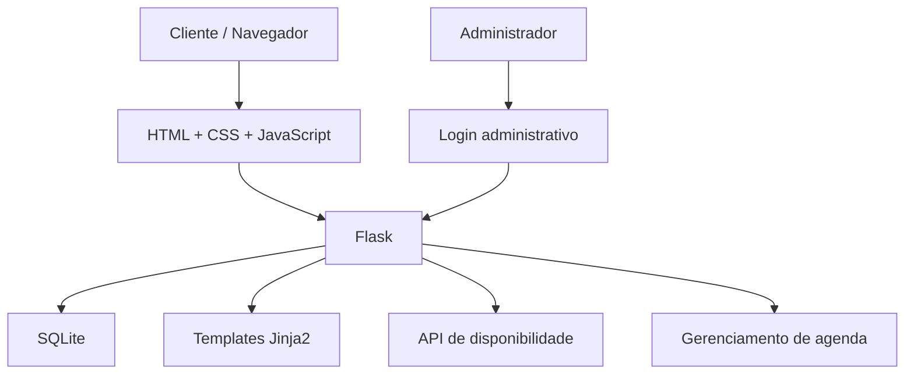

# Documentação Técnica — Studio Bastos

## 1. Visão geral

O **Studio Bastos** é uma aplicação web de agendamento desenvolvida para permitir que clientes consultem a disponibilidade do salão e realizem reservas online.

Além da área pública, o sistema possui uma área administrativa protegida por autenticação, utilizada para gerenciamento da agenda, bloqueio de horários e configuração dos dias de funcionamento.

---

# 2. Objetivo do sistema

O sistema foi criado para facilitar o gerenciamento da agenda do Studio Bastos e reduzir a necessidade de realizar todos os agendamentos manualmente pelo WhatsApp.

A aplicação permite que a cliente:

- visualize os serviços;
- consulte datas disponíveis;
- consulte horários livres;
- realize um agendamento;
- receba confirmação após a reserva.

A administradora pode:

- visualizar os próximos agendamentos;
- cancelar agendamentos;
- bloquear horários;
- bloquear dias completos;
- remover bloqueios;
- configurar os dias de atendimento;
- configurar os horários disponíveis.

---

# 3. Tecnologias utilizadas

| Tecnologia | Utilização |
|---|---|
| Python | Linguagem principal do back-end |
| Flask | Framework web |
| SQLite | Banco de dados |
| HTML5 | Estrutura das páginas |
| CSS3 | Estilização e responsividade |
| JavaScript | Calendário e interação com a API |
| Jinja2 | Renderização dos templates |
| Git | Controle de versão |
| GitHub | Hospedagem do código |
| PythonAnywhere | Hospedagem da aplicação |

---

# 4. Arquitetura

O sistema utiliza uma arquitetura web simples baseada em Flask.



O navegador se comunica com o Flask por meio das páginas HTML e das rotas da API.

O Flask é responsável por:

- validar as requisições;
- consultar o banco de dados;
- controlar sessões;
- verificar disponibilidade;
- criar agendamentos;
- gerenciar o painel administrativo.

---

# 5. Estrutura do projeto

```text
studio-bastos/
│
├── app.py
├── README.md
├── DOCUMENTACAO.md
├── .gitignore
│
├── static/
│   ├── agenda.js
│   ├── logo.png
│   └── style.css
│
└── templates/
    ├── index.html
    ├── login.html
    └── admin.html
```

Arquivos utilizados somente no ambiente de produção:

```text
agenda.db
segredos.py
```

Esses arquivos não devem ser enviados para o GitHub.

---

# 6. Organização dos arquivos

## `app.py`

Arquivo principal da aplicação.

Responsável por:

- configuração do Flask;
- configuração da sessão;
- conexão com SQLite;
- criação das tabelas;
- regras de disponibilidade;
- API de agendamento;
- autenticação administrativa;
- cancelamento de agendamentos;
- bloqueio de horários;
- configuração de funcionamento.

---

## `templates/index.html`

Página principal utilizada pelas clientes.

Contém:

- apresentação do Studio Bastos;
- serviços;
- calendário;
- seleção de horários;
- formulário de agendamento;
- informações de contato.

---

## `templates/login.html`

Página de autenticação da área administrativa.

Solicita a senha configurada no arquivo privado:

```text
segredos.py
```

---

## `templates/admin.html`

Painel administrativo.

Permite:

- visualizar agendamentos;
- acessar telefone das clientes;
- cancelar reservas;
- bloquear dias;
- bloquear horários;
- visualizar bloqueios ativos;
- configurar dias de funcionamento;
- configurar horários.

---

## `static/agenda.js`

Responsável pelas interações da página de agendamento.

Entre suas funções estão:

- carregar a disponibilidade mensal;
- desenhar o calendário;
- buscar horários disponíveis;
- selecionar data;
- selecionar horário;
- validar o preenchimento básico;
- enviar o agendamento para o servidor;
- exibir mensagens de erro e sucesso;
- atualizar a disponibilidade após uma reserva.

---

## `static/style.css`

Responsável pela aparência da aplicação.

Inclui:

- identidade visual do site;
- responsividade;
- calendário;
- botões;
- área administrativa;
- formulário de login;
- mensagens de erro e sucesso.

---

# 7. Banco de dados

O projeto utiliza **SQLite**.

Arquivo:

```text
agenda.db
```

O banco é criado automaticamente caso ainda não exista.

---

## 7.1 Tabela `agendamentos`

Responsável por armazenar as reservas.

| Campo | Tipo | Descrição |
|---|---|---|
| id | INTEGER | Identificador |
| servico | TEXT | Serviço escolhido |
| data | TEXT | Data da reserva |
| hora | TEXT | Horário |
| nome | TEXT | Nome da cliente |
| telefone | TEXT | Telefone/WhatsApp |
| criado_em | TEXT | Data e hora da criação |

Existe a restrição:

```sql
UNIQUE (data, hora)
```

Isso impede a criação de dois agendamentos para o mesmo horário.

---

## 7.2 Tabela `bloqueios`

Armazena períodos em que o salão não aceita novos agendamentos.

| Campo | Tipo | Descrição |
|---|---|---|
| id | INTEGER | Identificador |
| data | TEXT | Data bloqueada |
| hora | TEXT | Horário bloqueado |
| motivo | TEXT | Motivo opcional |

Quando:

```text
hora = NULL
```

o sistema interpreta o registro como um bloqueio do **dia inteiro**.

---

## 7.3 Tabela `config`

Armazena configurações editáveis do funcionamento do salão.

| Campo | Tipo | Descrição |
|---|---|---|
| chave | TEXT | Nome da configuração |
| valor | TEXT | Valor salvo |

Atualmente são armazenadas configurações como:

```text
dias_abertos
horarios
```

---

# 8. Configuração padrão

Caso ainda não exista uma configuração salva no banco, o sistema utiliza:

### Dias

```text
Terça
Quarta
Quinta
Sexta
Sábado
```

Representados internamente por:

```python
[1, 2, 3, 4, 5]
```

---

### Horários

```text
09:00
10:00
11:00
12:00
13:00
14:00
15:00
16:00
17:00
```

Esses valores podem ser alterados pela área administrativa.

---

# 9. Serviços

Os serviços são definidos no `app.py`.

## Alongamento

- Fibra de vidro — R$ 150,00
- Molde F1 — R$ 120,00
- Banho de gel — R$ 60,00
- Blindagem — R$ 50,00

## Nail arts

- Encapsulada — R$ 7,00 por unha
- Francesinha — R$ 6,00
- Adesivo — R$ 3,00
- Pedraria — R$ 4,00
- Outros — R$ 1,50

## Manutenção

- Manutenção de molde F1 — R$ 80,00
- Manutenção de fibra de vidro — R$ 90,00

## Outros

- Remoção — R$ 30,00
- Reposição de unha — R$ 10,00 por unha
- Troca de formato — R$ 20,00

---

# 10. Rotas da aplicação

## Área pública

### `GET /`

Exibe a página principal.

---

### `GET /api/mes`

Consulta a disponibilidade de um determinado mês.

Parâmetros:

```text
ano
mes
```

Exemplo:

```text
/api/mes?ano=2026&mes=10
```

Resposta aproximada:

```json
{
    "2026-10-08": 7,
    "2026-10-09": 4,
    "2026-10-10": 0
}
```

O valor representa a quantidade de horários disponíveis naquele dia.

---

### `GET /api/horarios`

Retorna os horários de uma data.

Exemplo:

```text
/api/horarios?data=2026-10-08
```

Resposta:

```json
[
    {
        "hora": "09:00",
        "livre": true
    },
    {
        "hora": "10:00",
        "livre": false
    }
]
```

---

### `POST /api/agendar`

Cria um novo agendamento.

Exemplo de requisição:

```json
{
    "servico": "Fibra de vidro",
    "data": "2026-10-08",
    "hora": "14:00",
    "nome": "Cliente",
    "telefone": "11999999999"
}
```

Antes de salvar, o servidor verifica novamente se o horário continua disponível.

---

# 11. Rotas administrativas

## `/admin/login`

Métodos:

```text
GET
POST
```

Responsável pela autenticação administrativa.

---

## `/admin`

Exibe o painel administrativo.

Necessita autenticação.

---

## `/admin/cancelar/<id>`

Método:

```text
POST
```

Remove um agendamento.

---

## `/admin/bloquear`

Método:

```text
POST
```

Cria um bloqueio de horário ou de dia inteiro.

---

## `/admin/desbloquear/<id>`

Método:

```text
POST
```

Remove um bloqueio existente.

---

## `/admin/horarios`

Método:

```text
POST
```

Atualiza:

- dias de funcionamento;
- horários de atendimento.

---

# 12. Fluxo de agendamento

O fluxo realizado pela cliente funciona da seguinte forma:

```text
Cliente entra no site
        ↓
Seleciona um serviço
        ↓
Calendário consulta /api/mes
        ↓
Cliente seleciona uma data
        ↓
JavaScript consulta /api/horarios
        ↓
Cliente escolhe um horário
        ↓
Informa nome e WhatsApp
        ↓
JavaScript envia POST /api/agendar
        ↓
Flask valida os dados
        ↓
Flask verifica novamente a disponibilidade
        ↓
Agendamento é salvo no SQLite
        ↓
Cliente recebe confirmação
```

A segunda verificação feita no servidor é importante porque duas clientes podem estar visualizando o mesmo horário simultaneamente.

---

# 13. Fluxo administrativo

```text
Administrador acessa /admin
        ↓
Caso não esteja autenticado
        ↓
Redirecionamento para /admin/login
        ↓
Senha é validada
        ↓
Sessão administrativa é criada
        ↓
Painel é exibido
```

Depois da autenticação, o administrador pode gerenciar a agenda.

---

# 14. Segurança

O projeto possui algumas proteções importantes.

## Dados sensíveis fora do Git

O arquivo:

```text
segredos.py
```

armazena:

```python
ADMIN_SENHA
SECRET_KEY
```

Ele está incluído no `.gitignore`.

---

## Banco de dados fora do Git

Arquivos:

```text
*.db
```

também são ignorados.

Isso evita publicar dados das clientes.

---

## Proteção CSRF

Todas as principais operações `POST` utilizam token CSRF.

Exemplos:

- login;
- agendamento;
- cancelamento;
- bloqueios;
- configuração de horários.

---

## Proteção da sessão

Os cookies possuem:

```text
HttpOnly
SameSite=Lax
```

Em produção também é possível habilitar:

```text
Secure
```

quando a aplicação utiliza HTTPS.

---

## Validação de dados

O back-end valida:

- serviço;
- nome;
- telefone;
- data;
- hora;
- disponibilidade.

A validação não depende apenas do JavaScript do navegador.

---

## Controle de horários duplicados

Além da verificação feita pela aplicação, o banco possui:

```sql
UNIQUE(data, hora)
```

Assim, mesmo em caso de requisições simultâneas, o banco impede duas reservas no mesmo horário.

---

# 15. Arquivo `segredos.py`

O arquivo não faz parte do repositório.

Exemplo:

```python
ADMIN_SENHA = "senha-forte"

SECRET_KEY = "chave-aleatoria"
```

Uma `SECRET_KEY` pode ser criada com:

```bash
python -c "import secrets; print(secrets.token_hex(32))"
```

Nunca publique esse arquivo.

---

# 16. Deploy no PythonAnywhere

A aplicação está hospedada no PythonAnywhere.

Diretório utilizado:

```text
/home/Marina2222/aprendendo
```

O arquivo WSGI aponta para essa pasta:

```python
import sys

path = "/home/Marina2222/aprendendo"

if path not in sys.path:
    sys.path.insert(0, path)

from app import app as application
```

Depois de alterações no código Python, é necessário utilizar:

```text
Web → Reload
```

no painel do PythonAnywhere.

---

# 17. Backup

O banco deve ser copiado antes de atualizações importantes.

Exemplo:

```bash
cd /home/Marina2222/aprendendo
cp agenda.db agenda_backup.db
```

O backup também é ignorado pelo Git por utilizar a extensão `.db`.

---

# 18. Atualização pelo Git

Após uma alteração:

```bash
git status
git add .
git commit -m "Descrição da alteração"
git push
```

O `git status` deve ser consultado antes do commit para garantir que nenhum arquivo sensível será versionado.

---

# 19. Limitações atuais

A versão atual considera cada horário como uma vaga única.

Ainda não existe controle individual da duração de cada serviço.

Por exemplo, um serviço de 30 minutos e um serviço de 2 horas utilizam atualmente o mesmo modelo de intervalo configurado.

Também não existem ainda:

- cadastro de múltiplos profissionais;
- reagendamento automático;
- confirmação automática pelo WhatsApp;
- histórico completo de clientes;
- pagamento online;
- painel financeiro.

---

# 20. Melhorias futuras

Possíveis evoluções:

- duração específica por serviço;
- intervalo entre atendimentos;
- múltiplas profissionais;
- cadastro de clientes;
- reagendamento;
- confirmação pelo WhatsApp;
- lembrete automático;
- histórico de agendamentos;
- dashboard administrativo;
- relatórios;
- controle de faturamento;
- upload de fotos;
- avaliações;
- página de portfólio;
- controle de feriados;
- recuperação de senha administrativa.

---

# 21. Controle de versão

O código-fonte do projeto é mantido utilizando Git e GitHub.

Branch principal:

```text
main
```

Repositório:

```text
https://github.com/marialcantz/studio-bastos
```

---

# 22. Autoria

**Marina Alcântara**

Projeto desenvolvido como aplicação prática de desenvolvimento web utilizando Python, Flask, JavaScript e SQLite.
